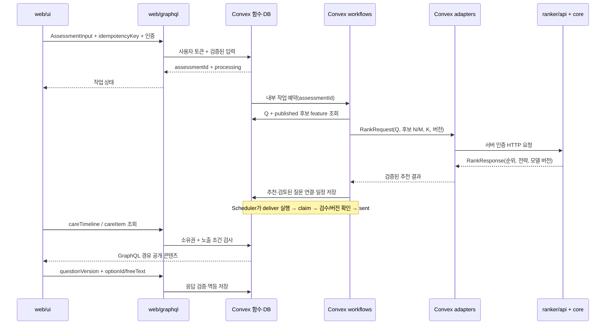

# 프로젝트 구조와 컴포넌트 연결

> 구현 전 설계. 하루 10시간 개발 순서는 [ROADMAP.md](ROADMAP.md)를 따른다. 디렉터리는 생성했으며 각 DESIGN.md의 컴포넌트는 구현 예정이다. 기존 작성 문서는 변경하지 않는다.

## 디렉터리 구조

```text
apps/
  web/
    ui/                  # 화면·사용자 입력
    graphql/             # 서버 GraphQL·인증 전달
convex/
  workflows/             # 처리 흐름·예약·상태 전이
  adapters/              # 외부 AI·Python HTTP 연결
services/
  ranker/
    api/                 # HTTP 인증·요청/응답
    core/                # 공통 feature·랭킹·MMR
training/                # 오프라인 학습·평가
  lambdamart/            # XGBRanker 학습 경계·규격
trainset/                # 학습 데이터 규격 템플릿, 현재 데이터 없음
contracts/               # TS/Python 공통 계약
config/                  # 버전 관리 설정, 비밀 제외
content/                 # 직접 작성한 칼럼·질문 seed
fixtures/
  synthetic/             # 독립 합성 보고서·노트
artifacts/               # 생성 모델·manifest·평가
scripts/                 # seed·export·학습·데모 실행
tests/                  # 계약·단위·통합·E2E
```

모든 위 디렉터리에 DESIGN.md를 둔다. 한 가지 책임을 가진 모듈 단위이며, 디렉터리마다 프로세스나 패키지를 따로 만드는 것은 아니다. apps/web은 웹 실행 단위, Convex는 backend, services/ranker는 Python 실행 단위다.

## 런타임 데이터 흐름



## 사전 준비와 학습 데이터 흐름

1. `content + config → scripts → Convex`: 기준문서·칼럼 seed와 검토 기록 등록.
2. `workflows → adapters → Jev/reranker/LLM`: 칼럼별 N/M feature와 질문 초안 생성. `adapters → workflows → Convex`로 검증 결과 저장. 질문은 별도 검토 후 사용한다.
3. `Convex → scripts → artifacts`: 버전이 고정된 칼럼 feature snapshot export. 학습과 추론이 같은 축을 사용한다.
4. `fixtures/synthetic + content + feature snapshot + config → trainset → training/lambdamart → ranker/core`: 보고서별 feature pair 조립·학습·평가. 현재 trainset에는 규격 템플릿만 있다.
5. `training → artifacts → ranker`: 모델+manifest 저장 후 읽기 전용 로드. 런타임에서는 재학습하지 않는다.

당일 seed 질문은 관리용 검토 명령을 통해 연결한다. cache miss 시 workflow가 생성할 수 있지만 검토 전 초안을 사용자에게 바로 보내지 않고 검토된 고정 질문을 사용한다.

## 공통 설계 규칙

- contracts가 데이터 계약의 원본이다. TS와 Python 구현은 공통 fixture로 호환성을 확인한다.
- Convex가 사용자·추천 실행·예약·응답의 원본 상태를 소유한다. 다른 모듈은 DB에 직접 쓰지 않는다.
- `requestId`, `runId`, `scheduleVersion`, feature/model 버전을 추적한다. 로그에 보고서 원문·자유응답을 기록하지 않는다.
- 공개 DTO의 `questionPrompt`와 내부 `generationPrompt`를 구분한다. feature 점수와 모델 확률은 UI에 내보내지 않는다.
- runtime 의존 방향은 `UI → GraphQL → Convex → adapter → ranker API → core`다. core는 DB·HTTP를 import하지 않는다. training은 core를 재사용하며 core는 training에 의존하지 않는다.
- **Facade, Adapter, Strategy, State Machine, Pipeline**을 필요한 경계에만 적용한다. 패턴을 위한 추상 클래스·이벤트 버스·별도 저장 계층은 만들지 않는다.

## 디렉터리별 설계 문서

| 디렉터리 | 책임·송수신·패턴 설계 |
|---|---|
| `apps/` | [DESIGN.md](apps/DESIGN.md) |
| `apps/web/` | [DESIGN.md](apps/web/DESIGN.md) |
| `apps/web/ui/` | [DESIGN.md](apps/web/ui/DESIGN.md) |
| `apps/web/graphql/` | [DESIGN.md](apps/web/graphql/DESIGN.md) |
| `convex/` | [DESIGN.md](convex/DESIGN.md) |
| `convex/workflows/` | [DESIGN.md](convex/workflows/DESIGN.md) |
| `convex/adapters/` | [DESIGN.md](convex/adapters/DESIGN.md) |
| `services/` | [DESIGN.md](services/DESIGN.md) |
| `services/ranker/` | [DESIGN.md](services/ranker/DESIGN.md) |
| `services/ranker/api/` | [DESIGN.md](services/ranker/api/DESIGN.md) |
| `services/ranker/core/` | [DESIGN.md](services/ranker/core/DESIGN.md) |
| `training/` | [DESIGN.md](training/DESIGN.md) |
| `training/lambdamart/` | [DESIGN.md](training/lambdamart/DESIGN.md) |
| `trainset/` | [README.md](trainset/README.md) · [schema.template.json](trainset/schema.template.json) · [manifest.template.json](trainset/manifest.template.json) |
| `contracts/` | [DESIGN.md](contracts/DESIGN.md) |
| `config/` | [DESIGN.md](config/DESIGN.md) |
| `content/` | [DESIGN.md](content/DESIGN.md) |
| `fixtures/` | [DESIGN.md](fixtures/DESIGN.md) |
| `fixtures/synthetic/` | [DESIGN.md](fixtures/synthetic/DESIGN.md) |
| `artifacts/` | [DESIGN.md](artifacts/DESIGN.md) |
| `scripts/` | [DESIGN.md](scripts/DESIGN.md) |
| `tests/` | [DESIGN.md](tests/DESIGN.md) |
