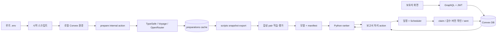

# PoC 구현 사항과 기존 계획의 보완

> 2026-10-03. 기존 ROADMAP·ARCHITECTURE·DESIGN·기획 문서는 수정하지 않는다. 현재 실행 상태는 이 문서와 README에 기록한다.

## 구현 경계

- `npm run demo`가 루트 `.env`를 읽고 로컬 Convex를 자동 구성한다. Convex 계정이나 cloud deployment 없이 실제 DB·Scheduler를 실행하는 방식을 택했다. [공식 로컬 agent mode](https://docs.convex.dev/cli/agent-mode)를 사용한다.
- 인증은 로컬 데모 계정의 scrypt 확인과 RS256 JWT 발급이다. 공개 JWKS를 Convex Custom JWT provider에 연결하고 같은 쿠키의 토큰을 GraphQL에서 검증·전달한다. [공식 Custom JWT 설정](https://docs.convex.dev/auth/advanced/custom-jwt)에 따른 구현이다.
- `.env → 시작 스크립트 → 로컬 Convex 환경 → workflows/prepare action → providers` 순서로 키를 전달한다. 외부 호출 결과는 Convex preparations에 캐시하고, 학습용 snapshot만 scripts가 export한다.
- TypeSafe·Voyage는 직접 API, 질문 LLM은 OpenRouter를 사용한다. 각 키를 따로 읽는다. 공급자 별 제공 경로를 하나의 OpenRouter 키로 대신할 수 있다고 가정하지 않는다.

## 이전 문서와 달라진 부분

| 항목 | 현재 구현 |
|---|---|
| 실행 코드가 아직 없다는 기존 문구 | Next.js·GraphQL·Convex·Python 및 학습/검증 코드가 생성됨 |
| trainset에 split 파일을 둔다는 계획 | trainset은 템플릿만 유지. 생성 파일은 artifacts의 모델별 dataset에 저장 |
| 운영 인증 | 로컬 PoC 자체 JWT 제공자. 실제 서비스의 로그인 제공자 연결은 후속 |
| 원시 Q 입력 | 고정 6개 척도 수치 배열. composite/syndrome 구분은 config.qScales의 ID로 보존; 임상 라벨을 계산하지 않음 |
| 공급자 실행 모드 | auto/mock/live 설정과 별도로 feature 실제 출처 mock/live/mixed를 저장 |
| 질문 노출 | 생성 초안은 draft. 현재 버전의 승인 초안 우선, 없으면 검토된 고정 질문 |
| 콘텐츠 준비 | 사용자 요청 전에 action으로 feature·초안을 캐시. 사용자 요청에서는 모델 추론과 예약만 실행 |

## 데이터 흐름

## 완료 증거의 범위

모델 파일·평가표, TypeScript/Python 테스트, 실제 로컬 Convex를 사용하는 브라우저 테스트를 생성했다. 실제 공급자 API는 키가 없는 환경에서 실행하지 않았다. live HTTP adapter는 공식 API 형식을 참고하고 응답 fixture로 검사했다. 현재 결과를 live 외부 모델의 검증 완료로 해석하지 않는다.

설계의 후속 범위인 임상 전문가 검수, 실제 푸시·메일, 전체 재예약, 공개 배포·제출은 수행하지 않았다. `sent`는 클라이언트 조회 가능이며 실제 알림 전달이나 읽음 기록이 아니다.
