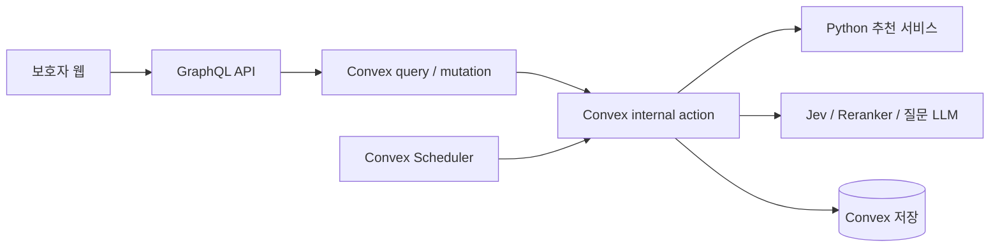

# PendingTimeCare 개발 로드맵

> 작성일: 2026-10-03 · 상태: 구현 전 계획
> 목표: 보고서 수령부터 상담 전까지, 관련 칼럼과 관찰 질문을 일정에 맞춰 제공하는 동작 가능한 PoC.
> 개발 일정: 1일, 순수 작업 10시간 기준(휴식 제외). 기존 기획안·계획·참고 문서·과제 원문은 수정하지 않는다.
> 디렉터리별 설계 진입점: [ARCHITECTURE.md](ARCHITECTURE.md). 현재 산출물은 구조와 설계 문서이며 실행 코드는 아직 없다.

## 1. 근거 문서와 구현 범위

| 근거 | 이 로드맵에 반영하는 내용 |
|---|---|
| [기획안.md](기획안.md) | F1~F7 범위, 칼럼 feature 사전 계산, 추천·질문·예약 흐름, 최소 화면, 평가 지표 |
| [plan.md](plan.md) | Q+N+M feature, LambdaMART와 다양성 선택, 이틀 간격 콘텐츠 |
| [plan_training_pipeline.md](plan_training_pipeline.md) | 합성 상담 노트, XGBRanker, BM25, 기준문서·상담유형 |
| [plan_backend.md](plan_backend.md) | GraphQL 단일 진입점, Convex 권한·상태·스케줄링, claim과 재시도 |
| [ABOUT_JEV.md](ABOUT_JEV.md) | 독립 Noul, 응답 검증, 모델·질문 버전, 오류 처리 |
| 로컬 과제 원문·CBCL 샘플 | 핵심 기능 1~2개, 3일 제출 조건, README 요건, 결측 입력, 공유 제한 |

현재 저장소에는 기획 문서만 있고 애플리케이션·학습 코드·실행 설정은 없다. 아래 경로, 데이터 규모, 작업 시간, 구현 기준은 **개발 제안**이며 이미 구현되거나 검증된 결과가 아니다. 실제 제출 마감은 과제 수신 시각을 기준으로 별도 확인한다.

### PoC 완료 범위

- **핵심 1 — 추천:** 구조화 보고서 → 수치 feature → 칼럼 feature와 결합 → 학습한 XGBRanker → 다양성을 반영한 Top-K.
- **핵심 2 — 질문·예약:** 칼럼 기반 관찰 질문 생성·검증 → 검수된 질문 연결 → Convex 예약 → 보호자 조회·응답 저장.
- 당일 지원 기능: 최소 인증 연결, 합성 보고서 선택·등록, 진행 상태, 칼럼 열람, 질문 응답·건너뛰기, 고정 용어집 1개. 범용 보고서 업로드·파싱은 후속으로 둔다.
- 후속 범위: 상담 변경/취소 UI와 재예약, 실제 푸시·메일, 상담사 화면, 응답 요약, 검수용 운영 UI, 파일럿 A/B 테스트. 취소된 일정과 오래된 scheduleVersion의 실행 차단은 당일 구현한다.
- 진단·처방·개인별 임상 해석·위험도 판정은 구현하지 않는다. 질문은 생활 관찰을 돕고, 응답은 자동 진단 입력으로 사용하지 않는다.

## 2. 문서 간 차이를 해결하는 구현 기준

원문을 고치지 않고 아래 기준을 코드와 새 문서에 적용한다.

| 쟁점 | PoC 구현 기준 | 이유·후속 확인 |
|---|---|---|
| Jev 입력이 보고서인지 칼럼인지 | 기획안 §4.4를 기준으로 **칼럼 본문**에서 M개 관련도를 사전 계산한다. 보고서별 Jev 호출은 후속 실험으로 분리한다. | 후보 칼럼마다 다른 N+M feature가 있어야 순위를 학습할 수 있고, 게시 시 캐시 설계와 일치한다. |
| N개 reranker feature의 대상 | 후보 칼럼을 query, 고정 기준문서 N개를 documents로 사용한다. | 보고서마다 N개를 다시 계산하는 흐름도와 달리 상세 설계를 따른다. |
| logit과 확률 표현 혼용 | M개 값은 Noul의 `[0, 1]` 확률 그대로 저장한다. 합을 1로 정규화하거나 logit으로 변환하지 않는다. | feature 의미와 검증 기준을 고정한다. |
| Q+N+M과 추가 BM25 feature | 기본 모델은 Q+N+M feature를 사용하는 Reranker 모델. BM25는 다양성 확보에 사용하고, 추가 입력은 별도 schema 버전의 실험으로 둔다. | 비슷한 내용의 칼럼이 계속 추천되는 것을 방지한다. |
| 질문을 사용자마다 생성하는 비용 도식 | `columnVersion + promptVersion + modelVersion + locale` 단위로 생성·재사용한다. | 기획안 §4.5의 칼럼별 캐시를 우선한다. |
| 이틀 간격과 상담 2일 전 고정 발송 | 첫날부터 이틀 간격의 칼럼 슬롯을 만들고 K개로 제한한다. 상담 2일 전 메시지를 별도로 추가하지 않는다. | 중복·콘텐츠 수 초과를 방지하며 D=6 타임라인을 재현한다. |
| `max(1, floor(D/2))`의 당일·과거 예약 | 상담이 이미 시작됐으면 일정 0개. 미래 상담에는 유효한 상담 전 슬롯만 사용한다. | 최소 1개 규칙보다 상담 후 발송 금지를 우선한다. |
| Jev 모델·endpoint·SDK, reranker 제공 경로 | 문서의 이름은 후보 설정으로 취급하고 1단계에서 실제 계정과 공식 문서로 검증한다. | 이 로드맵은 최신 제공 여부·가격·호환성을 확인한 문서가 아니다. |
| CBCL cutoff 예시 차이 | 원시 수치와 척도 종류를 보존한다. 검증되지 않은 공통 cutoff로 임상 라벨을 새로 계산하지 않는다. | 종합·개별척도 혼동을 피한다. 임상 규준 확정은 별도 전문가 검토 대상이다. |

## 3. 구성과 새 파일 배치

웹과 GraphQL은 TypeScript, 추천 학습·추론은 Python으로 분리한다. 웹/API 구현 후보는 Next.js이며 프레임워크 선택 자체를 PoC의 핵심 작업으로 확대하지 않는다. Convex는 DB·인증 연계·스케줄러를 담당한다.



- 브라우저의 서비스 데이터 접근은 GraphQL만 사용한다. GraphQL에서 검증한 사용자 신원을 Convex에서도 검증하고 소유권을 재확인한다. 브라우저가 보낸 `guardianId`를 권한 근거로 신뢰하지 않는다.
- 인증 발급·검증 방식과 GraphQL→Convex 토큰 전달은 첫 1시간의 연결 실험으로 확정한다. 다른 보호자 데이터 접근 차단까지 확인한다.
- Python 추론은 별도 HTTP 서비스로 실행한다. Convex가 호출할 수 있는 개발용 주소와 서버 인증 토큰을 준비한다. 로컬 데모에서도 Convex가 개발자 PC의 localhost에 직접 접근할 수 있다고 가정하지 않는다.
- Python 요청에는 필요한 수치와 후보 feature만 전달하고 사용자 이름·보고서 원문은 제외한다. 임의 모델 경로나 파일 업로드를 받지 않는다.
- 외부 API 호출은 action, 최종 상태 저장은 mutation으로 분리한다. GraphQL mutation은 오래 기다리지 않고 작업 ID와 상태를 반환한다.

실제 생성한 디렉터리와 각 `DESIGN.md`는 [ARCHITECTURE.md](ARCHITECTURE.md)에서 연결한다. 웹 화면과 서버 GraphQL, Convex 업무 흐름과 외부 adapter, Python 추천 core와 HTTP 계층을 구분한다. 각 문서는 책임, 데이터 송수신 상대, 구현 제약, 적용할 디자인 패턴 힌트를 담는다.

LambdaMART 학습 경계는 [training/lambdamart/DESIGN.md](training/lambdamart/DESIGN.md)에, 학습 데이터 형식은 [trainset/README.md](trainset/README.md)에 둔다. `trainset/`에는 현재 schema·manifest 템플릿만 있으며 실제 학습 데이터와 모델은 없다.

## 4. 데이터·API 계약 먼저 고정하기

### 4.1 보고서와 추천 feature

- `AssessmentInput`: `receivedAt`, `consultationAt`, `timezone`, `reportSchemaVersion`, 척도별 수치와 `measured` 여부. 보호자 ID는 인증 문맥에서 결정한다.
- 척도는 안정적인 ID와 `composite / syndrome / other` 구분을 가진다. 누락·미실시는 `null`로 표현하고 0점으로 대체하지 않는다.
- Q는 학습·추론에서 같은 순서를 사용한다. 필요 시 결측 여부 feature도 Q에 포함하고 manifest에 명시한다. 없는 백분위를 임의 계산하지 않는다.
- `columnFeatures`: 칼럼 버전, N개 기준문서 유사도, M개 상담유형 확률, 생성 상태, 공급자·모델·taxonomy·referenceSet·featureSchema 버전.
- feature 캐시 키에는 본문 해시와 모든 생성 버전을 포함한다. 내용 변경은 새 칼럼 버전으로 다루고 검수·feature를 갱신한다.
- 기준문서 축을 변경하면 전체 칼럼 feature 재계산과 재학습이 필요하다. 같은 축에 새 칼럼만 추가하는 경우에도 품질 평가 후 반영한다.

### 4.2 저장 엔티티

| 엔티티 | 주요 필드·제약 |
|---|---|
| `assessments` | guardianId, structuredReport, receivedAt, consultationAt, status, scheduleVersion, requestKey |
| `assessmentFeatures` | assessmentId, Q, featureSchemaVersion. 칼럼 N/M은 중복 저장하지 않고 버전 참조 |
| `columns` / `columnFeatures` | 본문·버전, draft/reviewed/published, review 기록, feature·캐시 키 |
| `recommendationRuns` | assessmentId, inputHash, modelVersion, algorithmVersion, status, fallbackReason |
| `recommendations` | runId, columnVersion, rank, 내부 score, feature 버전 |
| `questions` | columnVersion, prompt, 고유 optionId 3개, draft/reviewed/rejected, model/prompt 버전, reviewer, reviewedAt |
| `scheduledMessages` | assessmentId, scheduleVersion, kind, slotIndex, scheduledAt, status, attemptCount, claimToken, leaseUntil |
| `responses` | guardianId, assessmentId, questionVersion, 선택 optionId 또는 skipped, 선택 자유응답, submittedAt |

논리적 고유 키는 Convex mutation 안에서 조회·생성을 하나의 트랜잭션으로 처리한다. 인덱스만으로 uniqueness가 보장된다고 가정하지 않는다.

### 4.3 최소 GraphQL 인터페이스

| 종류 | 이름 | 동작 |
|---|---|---|
| Mutation | `createAssessment(input, idempotencyKey)` | 입력 검증·중복 방지 후 처리 작업 예약 |
| Query | `assessment(id)` | 본인 보고서의 처리 상태와 공개 가능한 준비 정보 |
| Query | `careTimeline(assessmentId)` | 전달된 콘텐츠와 미래 일정의 제한된 메타데이터 |
| Query | `careItem(id)` | 소유권·sent·게시/검수 상태를 확인한 본문·질문 |
| Mutation | `submitResponse(input)` | 질문 연결 관계·선택지 확인, 동일 응답 중복 저장 방지 |
| Mutation | `skipQuestion(input)` | 건너뛰기 저장, 응답 완료와 구분 |
| 후속 Mutation | `rescheduleConsultation(input)` / `cancelCare(id)` | 미래 일정 무효화·재생성 또는 취소. 당일에는 내부 mutation으로 무효화·실행 차단만 검증 |

GraphQL과 Convex 양쪽에서 권한을 검증한다. 보고서 원문, 관련도 확률, 내부 prompt, API key는 보호자 화면 응답에 포함하지 않는다. 외부 오류는 `INVALID_INPUT / FORBIDDEN / PROCESSING / TEMPORARY_UNAVAILABLE` 등 안정적인 오류 코드로 변환한다.

## 5. 하루 개발 순서와 완료 기준

작업 시작부터 10시간을 배정한다. 계정·키·개발 도구가 준비돼 있다는 가정이며, 연결 실패는 정해진 시간 안에 명시적인 대체 경로로 전환한다. 기존 3일 작업량을 그대로 압축하지 않고 데이터 규모·화면·실험 수를 줄인다.

| 단계 | 경과 시간 | 구현 작업 | 완료 기준 |
|---|---|---|---|
| M0 기반·연결 | 00:00–01:00, 60분 | 웹/GraphQL/Convex 인증 왕복, Python 호출, 공급자 연결 확인, live/mock 선택 | 본인 데이터 왕복·타인 접근 거부, Convex→Python 연결 또는 미연결 사유 기록 |
| M1 계약·seed | 01:00–02:00, 60분 | 공통 schema, 기준문서 3개·칼럼 6개·합성 보고서/노트 20건, taxonomy 6개, 고정 질문 | 결측·버전·ID 검증, 공개 가능한 독립 합성 데이터 확보 |
| M2 추천 | 02:00–04:00, 120분 | feature 캐시, 학습 1회, MMR 적용 전후 비교, Python 추론 | 동일 입력의 중복 없는 Top-K, 모델·manifest·평가 결과 저장 |
| M3 질문 | 04:00–05:00, 60분 | 칼럼 기반 JSON 생성, 검사, 검토 기록, 고정 질문 fallback | 선택지 3개, 미검수/부적절한 초안 노출 차단 |
| M4 관제·예약 | 05:00–07:00, 120분 | 보고서 처리 workflow, 일정 계산, claim·lease·복구·무효화 | 실제 예약 실행, 중복 sent 방지, 취소/오래된 작업 차단 |
| M5 최소 화면 | 07:00–08:00, 60분 | 합성 입력 선택, 홈/칼럼/질문, 저장·건너뛰기 | 로그인부터 응답 저장·새로고침 복원까지 연결 |
| M6 검증·실행 문서 | 08:00–09:30, 90분 | 핵심 테스트, live/mock 시연, README·비용·제약 기록 | 다른 실행 환경에서 따라 할 절차와 E2E 증거 확보 |
| 여유 | 09:30–10:00, 30분 | 핵심 흐름 결함 수정·재확인 | 실패 항목·후속 항목을 명시하고 종료 |

### M0·M1 구현 지침

- [ ] 공급자 연결 확인은 20분으로 제한한다. 문서의 모델/경로는 공식 자료와 최소 요청으로 검증하고, 미지원이면 adapter를 mock으로 전환한다. 실호출 성공처럼 보고하지 않는다.
- [ ] 인증은 기존 제공 기능을 연결하는 수준으로 제한한다. 사용자 ID 하드코딩으로 소유권 검증을 대체하지 않는다.
- [ ] Q는 척도 수치·결측 여부, N=3은 기준문서 축, M=6은 독립 상담유형 관련도다. 계약과 feature 순서를 먼저 고정한다.
- [ ] 20건의 합성 보고서와 6개 칼럼으로 120개 학습 pair를 만든다. 원본/family 단위 12/4/4 train/validation/test를 목표로 하고 증강 family는 섞지 않는다.
- [ ] 후보 칼럼과 고정 질문은 개발자 검토의 데모임을 표시한다. 전문가 검수 이력을 만들어내지 않는다.

### M2 구현 지침

- [ ] 칼럼 feature는 게시 준비 때 계산한다. reranker 결과는 반환 순위가 아니라 기준문서 ID 순서로 재배열하고 Noul은 합을 정규화하지 않는다.
- [ ] 캐시 키는 칼럼 본문 해시, model/prompt/taxonomy/referenceSet/featureSchema 버전을 포함한다.
- [ ] relevance label 0/1/2/3은 상담 노트와 별도 rubric에서 정한다. Jev 출력값을 정답으로 복제하지 않는다.
- [ ] XGBRanker `rank:ndcg`를 보고서별 query group으로 1회 학습한다. 학습/서빙은 `services/ranker/core`의 동일 feature builder를 사용한다.
- [ ] XGBRanker 단독과 XGBRanker+MMR의 NDCG@3·주제 coverage·문서 간 유사도·처리 시간을 동일 held-out 데이터로 비교한다. BM25는 후보 칼럼 간 유사도를 계산해 MMR의 다양성 penalty로만 사용한다.
- [ ] MMR λ=0.7. XGBRanker 관련도와 칼럼 간 BM25 유사도를 각각 [0,1]로 정규화한다. BM25는 음수를 0으로 자른 뒤 방향별로 정규화하고 양방향 평균으로 대칭 유사도를 만든다. 정규화 분모가 0이면 유사도는 0, 관련도가 모두 같으면 같은 정규화 값을 사용한다. 동점은 columnId로 결정한다.
- [ ] 빈 후보, 동일 점수, K 초과, NaN, feature/model 버전 불일치를 처리한다. MMR 적용으로 관련도 품질이 과도하게 떨어지면 validation에서 λ를 조정하거나 XGBRanker 단독 순위를 사용한다. test 결과로 설정을 반복 조정하지 않는다.

합성 데이터 20건은 실행 검증용이다. 임상 타당성이나 실사용 추천 성능을 입증하지 않는다. BM25의 query와 document는 모두 칼럼 본문이다. 보고서를 검색 query로 변환하는 로직은 구현하지 않는다. 토크나이저·BM25 설정·유사도 정규화 규칙은 algorithmVersion에 포함한다.

### M3·M4 구현 지침

- [ ] 질문 요청에는 칼럼 본문만 사용한다. 구조·길이·진단 표현·개인정보 요구를 검사하고 통과 결과도 draft로 저장한다.
- [ ] 생성 실패 시 최대 1회 수정 후 검토된 고정 질문으로 전환한다. 검토자·시각·질문 버전과 데모/전문가 검수 범위를 구분한다.
- [ ] 같은 column/prompt/model/locale의 검토된 질문을 재사용한다. 새 버전에 이전 검수 승인을 승계하지 않는다.
- [ ] `processing → ready/degraded/failed` 상태와 fallback 이유를 저장한다. 준비되지 않은 질문은 발송하지 않는다.
- [ ] §6의 일정 순수 함수와 `pending → processing → sent`를 구현한다. lease 만료 복구·claimToken·scheduleVersion 검사를 포함한다.
- [ ] 당일에는 내부 무효화와 상담 후 실행 차단을 검증한다. 보호자용 예약 변경/취소 API·UI와 전체 재예약은 후속이다.

### M5·M6 구현 지침

- [ ] 화면은 기획안 목업의 최소 기능만 구현한다. 저장 중·실패·빈 상태와 비진단 안내를 포함한다.
- [ ] 응답 optionId/질문 소속을 검사하고 중복 제출을 방지한다. 진행률은 실제 완료만 반영한다.
- [ ] 정상·결측·외부 API 장애·타인 접근·중복 claim·lease 만료·무효화 흐름을 테스트한다.
- [ ] 실제 Convex 예약은 별도 단축 데모 설정으로 검증한다. 일반 서비스의 시간 계산은 변경하지 않는다.
- [ ] README에 실행 순서·모델/API·환경 변수·비용·mock 여부·알려진 한계를 기록한다.
- [ ] PDF 내보내기, 공개 배포본 정리, 공개 전환·메일 제출은 당일 개발 완료 이후 후속 작업으로 둔다. 원본 문서는 유지한다.

의존 관계: `M0 → M1 → M2 → M3 → M4 → M5 → M6`. 당일 완료는 구현·최소 검증·실행 문서까지이며, 실제 서비스 운영 준비나 제출 완료를 뜻하지 않는다.

## 6. 일정 정책과 실패 복구 상세

### 6.1 일정 계산

시간은 저장 시 UTC, 날짜 계산·표시는 `Asia/Seoul`을 기본으로 한다. D는 수령일과 상담일의 현지 달력 날짜 차이로 정의한다. 테스트에서 현재 시각을 주입할 수 있게 한다.

1. `consultationAt <= now`이면 새 일정은 만들지 않는다.
2. 상담이 미래라면 `K_target = min(사용 가능한 고유 칼럼 수, max(1, floor(D/2)))`.
3. 수령 시각과 이후 현지 시각 기준 2일 간격으로 후보 슬롯을 생성한다. 상담 시작 이전 슬롯만 남기고 K_target개를 취한다.
4. 수령 후 처리가 늦어졌다면 지난 칼럼 슬롯은 즉시 슬롯 하나로 합치고 나머지 지난 슬롯은 버린다. 하루 한 개 칼럼 한도를 적용한다.
5. 용어 설명은 상담 전날 09:00에 별도 예약한다. 수령 전 시각이거나 이미 지났으면 홈의 고정 용어집으로 제공한다.
6. 용어 설명과 칼럼이 같은 날이면 한 개 준비 카드로 묶는다. 같은 날 중복 알림을 만들지 않는다.
7. 실제 K는 유효 슬롯 수와 후보 수에 의해 줄어들 수 있다. 모든 실행 직전에 상담 시각을 다시 확인한다.

| 입력 예 | 기대 결과 |
|---|---|
| D=6, 수령 09:00·상담 09:00 | 수령일/+2일/+4일 칼럼 3개, +5일 용어 설명 |
| D=3 | 수령일 칼럼 1개, 상담 전날 용어 설명 |
| D=2 | 수령일 칼럼 1개, 상담 전날 용어 설명 |
| D=1 | 수령일 칼럼 1개, 용어 설명은 같은 카드 또는 고정 용어집 |
| D=0, 같은 날 미래 상담 | 즉시 준비 카드 최대 1개, 전날 메시지 없음 |
| 상담 시각이 지남 | 새 예약 0개 |
| 후보 0개 | 승인된 공통 준비 콘텐츠 또는 명시적인 콘텐츠 없음 상태 |

### 6.2 예약 상태와 멱등성

```text
pending → processing → sent
             └→ pending (재시도 가능)
             └→ failed  (최대 시도 초과)
pending / processing → cancelled
```

- 일정 고유 키: `(assessmentId, scheduleVersion, kind, slotIndex)`.
- claim은 mutation에서 수행하고 `claimToken`, `leaseUntil`을 발급한다. 오래된 worker가 새 claim 결과를 덮어쓰지 못하게 토큰을 검사한다.
- 초기 운영 설정 제안: 최대 3회 시도, 10초·30초 재시도, lease 60초. 값은 JSON 설정으로 관리하고 외부 요청 timeout과 일관되게 조정한다.
- lease 만료 작업은 주기적인 복구 작업이 찾아 재예약한다. 실행이 끝난 callback 자체에만 복구를 의존하지 않는다.
- 400/401/422 등 입력·인증 문제는 자동 반복하지 않는다. 429·일시 장애는 서버 지시 대기시간을 존중하고 제한된 backoff를 적용한다.
- 당일에는 내부 mutation으로 scheduleVersion 증가·미래 일정 무효화를 구현한다. 후속 상담 변경 기능에서는 새 일정을 생성하되 sent 기록을 유지하고 같은 칼럼을 재발송하지 않는다.
- 콘텐츠가 철회됐거나 질문이 준비되지 않았으면 검토된 대체 콘텐츠를 선택하거나 지연/실패 처리한다. 검수 조건을 완화하지 않는다.

## 7. 검증 항목과 출시 판단

| 영역 | 필수 검증 | 통과 조건 |
|---|---|---|
| 입력 | 미실시, 필수값 누락, 날짜 역전, 종합/개별 ID 구분 | 누락은 유지하고 잘못된 입력은 명확히 거부 |
| Feature | N/M 순서·길이, NaN, 모델/축 버전, 확률 합이 1 초과 | 합이 1 초과인 정상 multi-label은 허용, 계약 위반은 거부 |
| 추천 | K=0/1/후보 초과, 동점, 중복, 비게시 칼럼 | 결정적 결과, 중복 없음, published 후보만 선택 |
| 학습 | report/family split, label 다양성, 동일 평가 셋 | 누수 없이 XGBRanker 단독과 MMR 적용 결과 비교 가능 |
| 질문 | 구조 위반, 진단·개인정보 요청, prompt injection, 미검수 상태 | 부적절한 초안·미검수 결과의 노출 0건 |
| 권한 | 다른 guardian의 assessment/item/response ID 사용 | 읽기·쓰기 모두 거부 |
| 예약 | D=0/1/2/3/6, 날짜 경계, 중복 claim, lease 만료, 취소 경합 | 상담 후 노출 0건, 동일 일정의 이중 sent 0건 |
| 응답 | 중복 저장, 다른 질문 optionId, 새로고침 | 잘못된 참조 거부, 중복 없음, 저장 지속 |
| 통합 | 등록→추천→예약→열람→응답, API 장애 | 성공 흐름 재현, 장애 사유와 fallback 추적 가능 |

안전·권한·중복 처리 실패는 PoC 완료 차단 조건이다. MMR 적용 결과는 XGBRanker 단독 순위와 관련도·다양성의 변화를 함께 보고한다. 모델 추론 실패 시에는 검토된 공통 준비 콘텐츠로 대체하고 실패 사유를 기록한다. 실 API 연결이 없으면 mock PoC로 명시하고 연동 완료로 보고하지 않는다.

## 8. 비용·성능 기록과 범위 축소 순서

### 비용 계산

- 신규/변경 칼럼 수 C개 기준으로 Jev C회, reranker C회, 질문 LLM은 cache miss 칼럼 수만큼 호출하는 것을 기본으로 한다. 재시도는 별도 합산한다.
- 보호자 처리마다 캐시된 칼럼 feature를 재사용한다. 보고서당 비용은 Python 추론, Convex 작업·저장, 캐시 누락분으로 나눈다.
- 텍스트 API 비용은 `입력 토큰 × 입력 단가 + 출력 토큰 × 출력 단가`로 기록한다. reranker가 별도 과금 단위를 쓰면 실제 요율대로 계산한다.
- 모델 단가·무료 구간은 M0에서 확인하고 확인 날짜를 붙인다. 문서에 제시된 가격이나 latency를 실측값으로 사용하지 않는다.
- 캐시 hit/miss, 공급자·모델, 토큰/과금 단위, 처리 시간, 재시도 횟수, fallback 이유를 기록한다. 로그에는 보고서 원문과 자유응답을 남기지 않는다.
- 소수 샘플의 latency는 표본 수와 함께 보고한다. 불안 감소·No-show 감소는 별도 파일럿 지표이며 PoC 결과로 주장하지 않는다.

### 시간 초과 시 범위 조정

1. 실 API가 막히면 표시된 mock을 사용한다. 이후 실 연동은 미완료로 남긴다.
2. 화면 장식, 추가 용어집, 하이퍼파라미터 탐색, 추가 데이터 증강은 하지 않는다.
3. 권한·노출 조건·멱등성 검증 시간을 먼저 확보한다. 핵심 코드가 지연되면 선택 기능 대신 여유 30분을 사용한다.
4. 10시간 내 완료되지 않은 웹 연결·학습·예약은 해당 항목을 미완료로 보고한다. CLI/mock 시연은 대체 시연으로 명시하고 전체 완료로 간주하지 않는다.

## 9. PoC 이후

- **예약 관리·제출:** 상담 변경/취소 API·UI와 전체 재예약을 구현한다. 기획안 PDF, 공개 배포본, 제출 절차를 별도로 마무리한다.
- **실데이터·전문가 검토:** 사용할 권한이 확보된 보고서–상담 노트 pair와 전문가 relevance label을 수집한다. rubric 일치도와 추천 타당성을 검토하고 합성 데이터 편향을 평가한다.
- **운영 검수:** 칼럼·질문 검수 UI, 승인 이력, 철회와 예약 영향 처리를 추가한다. 개발자 데모 검토를 임상 전문가 승인으로 대체한다.
- **상담 연계:** 응답 이력을 상담사가 열람하는 F6를 구현한다. 요약 생성 도입 시 원문 추적과 별도 검토를 설계한다.
- **실제 알림:** notification adapter를 추가하고 공급자 idempotency key·전달 실패·수신 동의 정책을 연결한다. sent와 delivered를 분리한다.
- **파일럿:** No-show, 문의 수, 콘텐츠 참여, 상담 전 불안 자기평가, 상담사 유용도를 측정한다. 실험 기간·대상·판정 기준을 사전에 정한다.

## 10. 하루 개발 완료 체크리스트

- [ ] F2 추천과 F3/F4 질문·예약이 동작하며 대체 경로 사용 여부가 구분된다.
- [ ] 새 합성 데이터로 학습·평가·서빙을 재현할 수 있다.
- [ ] 개인정보·비공개 과제 자료·API 키가 공개 파일 및 이력에 없다.
- [ ] 보호자 화면에 진단·확률값·미검수 질문이 노출되지 않는다.
- [ ] 내부 일정 무효화·상담 후 차단·중복 실행·외부 장애를 검증했다. 전체 재예약은 후속으로 표시했다.
- [ ] README 필수 항목, 평가 결과, 비용 산식, 알려진 한계가 준비됐다.
- [ ] 기존 작성 파일이 보존됐고 새 산출물만 추가됐음을 확인했다.
