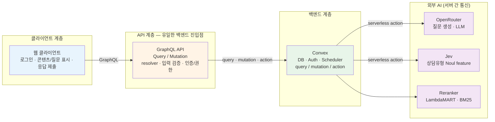

# 백엔드 구현 계획

AI는 검사 결과를 바탕으로 진단하거나 처방하지 않는다. AI의 역할은 콘텐츠 추천에 필요한 관련도 feature를 계산하고, 이미 검수된 칼럼을 보호자가 이해하기 쉬운 질문과 함께 배치하는 데 한정한다.

---

## 권장 시스템 구성



> GraphQL resolver는 Convex 함수를 호출하고, **API key·prompt·민감 보고서**는 Convex action에서만 외부 AI로 전달한다. 클라이언트는 외부 AI에 직접 접근하지 않는다.

### 컴포넌트별 책임

| 컴포넌트 | 책임 | 책임지지 않는 것 |
|---|---|---|
| 클라이언트 | 로그인, GraphQL 호출, 콘텐츠/질문 표시, 응답 제출 | 추천 점수 계산, AI 프롬프트 관리 |
| GraphQL API | 클라이언트용 Query/Mutation schema, resolver, 입력 검증 | 데이터의 최종 저장, AI API key 관리 |
| Convex | 인증, 영속성, 상태 전이, 권한 검사, 스케줄링, serverless action | 모델 학습 |
| 외부 AI API | OpenRouter를 통한 질문 생성 및 필요한 모델 추론 | 사용자 권한, 예약 상태의 최종 관리 |
| 콘텐츠 운영 영역 | 칼럼 작성·검수·게시 상태 관리 | 보호자별 개인 진단 |

GraphQL은 클라이언트의 유일한 백엔드 진입점으로 사용한다. GraphQL resolver는 Convex query/mutation/action을 호출하고, 데이터 접근 권한은 resolver와 Convex 함수 양쪽에서 확인한다.

Convex serverless action에서 OpenRouter API를 호출하고, 결과 저장은 Convex mutation으로 수행한다. API key와 prompt는 클라이언트에 노출하지 않는다. 외부 호출과 DB 상태 변경을 분리해, 호출 실패 시 재시도 가능한 상태를 남긴다.


## 처리 흐름

### 검사 결과 수령

```text
1. 클라이언트 또는 기존 검사 시스템이 GraphQL mutation으로 assessment 생성
2. GraphQL resolver와 Convex mutation이 guardian 권한 및 입력 스키마 검증
3. assessment.status = processing
4. Convex internal action을 예약해 feature 생성 시작
5. Convex action이 필요한 외부 AI API에 구조화 보고서와 상담유형 질문을 전달
6. 결과의 범위(0~1), 필수 키, modelVersion을 검증
7. assessmentFeatures 저장
8. 추천 run 생성
```

검사 결과를 클라이언트가 직접 외부 AI API로 보내지 않는다. 보고서의 민감 데이터가 노출되지 않도록 Convex action에서 서버 간 통신만 사용한다.

### 칼럼 추천

1. `published` 칼럼만 후보로 조회한다.
2. 기준문서와의 reranker/BM25 feature를 계산한다.
3. Jev의 상담유형 feature를 Noul 확률값으로 반영한다.
4. LambdaMART/XGBoost Ranker가 관련도 점수를 계산한다.
5. 이미 선택된 칼럼과 유사한 후보에는 다양성 penalty를 적용한다.
6. 대기일에 맞춰 필요한 개수만 선택한다.
7. 결과를 `recommendations`에 순위와 함께 저장한다.

추천 점수는 다음 형태를 유지한다.

```text
score(d) = λ × relevance(d | report)
         − (1 − λ) × max(similarity(d, selectedDocuments))
```

초기값은 `λ = 0.7`로 두고 설정값으로 관리한다. `λ`는 사용자가 조정하는 값이 아니며 알고리즘 버전에 포함한다.

### 질문 생성

칼럼별 질문은 Convex action이 OpenRouter API를 호출해 생성하며, 다음 제약을 만족해야 한다.

- 칼럼 내용을 읽었는지 확인하는 질문이 아니라, 보호자가 아이의 현재 상황을 관찰하도록 돕는 질문이어야 한다.
- 선택지 3개와 자유응답란을 제공한다.
- 진단·처방·위험도 판정을 요구하지 않는다.
- 개인정보, 연락처, 민감한 제3자 정보를 요구하지 않는다.
- 모델 응답이 schema를 벗어나면 저장하지 않고 실패 처리한다.

OpenRouter 응답은 구조화 출력 또는 JSON schema로 받는다. action에서 사전 정의된 template, 길이 제한, 금칙어·진단 표현 검사를 적용한 뒤 `questions`에 저장한다. 운영 환경에서는 `reviewed` 질문만 보호자에게 노출한다.

### 콘텐츠 일정 생성

상담 예정일과 검사 수령일 사이의 기간을 `D`일이라고 할 때:

```text
필요 콘텐츠 수 = min(예정 콘텐츠 수, max(1, floor(D / 2)))
```

기본 일정은 다음과 같다.

- `D >= 1`: 즉시 또는 수령 당일에 첫 콘텐츠 예약
- `D >= 2`: 상담 2일 전 콘텐츠 예약
- `D >= 1`: 상담 1일 전 용어 설명/준비 콘텐츠 예약
- 상담 이후 시각으로 계산되면 해당 메시지는 생성하지 않음

JSON으로 파라미터 관리 가능하게 구성.

### 예약 메시지 처리

Convex scheduler의 `runAt`/`runAfter`는 알림을 보내는 최종 시스템이 아니라 처리를 시작하는 트리거로 사용한다.

```text
scheduledAt 도달
  → deliverScheduledMessage(scheduleId)
  → pending 상태를 processing으로 claim
  → 취소/중복 여부 확인
  → 클라이언트가 조회할 수 있는 sent 상태로 전환
  → 실패 시 attemptCount 증가 및 backoff 재예약
```

Convex는 트랜잭션 안에서 `pending`을 `processing`으로 변경해 하나의 실행만 claim하도록 한다. claim 이후 프로세스가 중단되면 일정 시간 후 `processing`을 재처리 가능한 상태로 되돌린다.

MVP에서 별도 push 알림을 구현하지 않는다면 `sent`는 “클라이언트가 조회 가능한 상태가 됨”을 뜻한다. 실제 푸시/이메일은 이후 notification adapter를 추가한다.