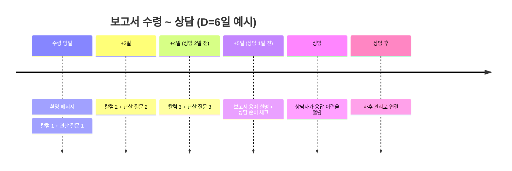
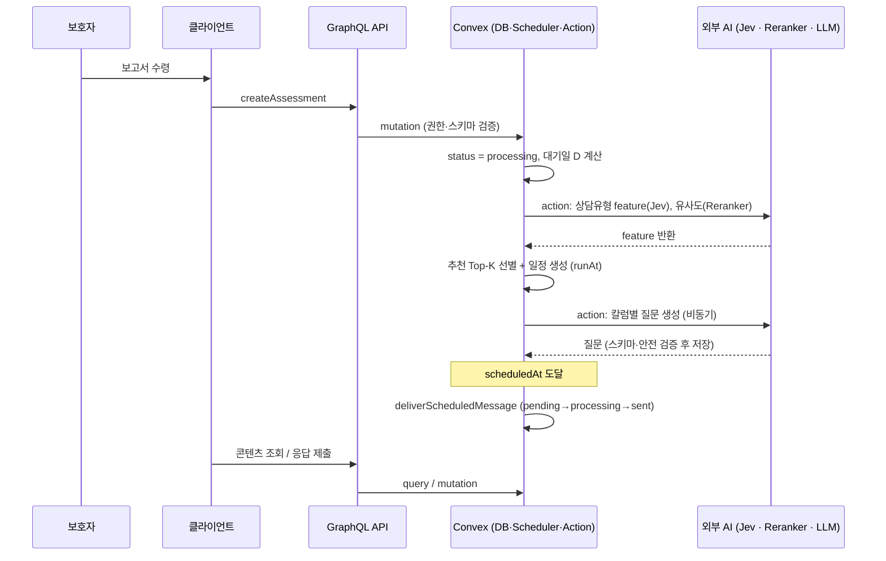
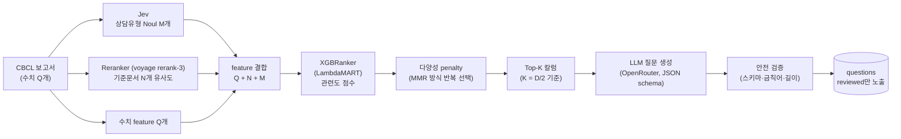
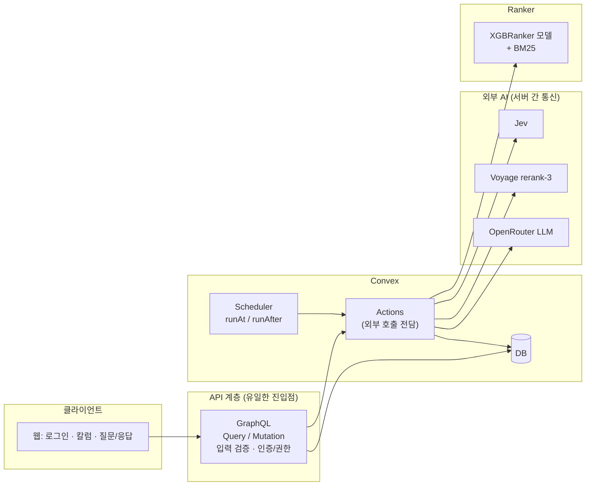
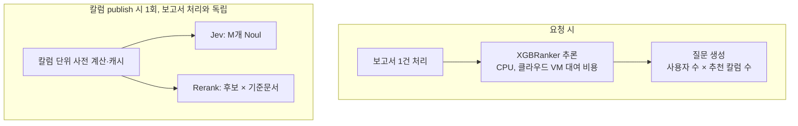

# 아맘때 "대기 기간 케어" — 보고서 수령부터 상담 전까지의 불안을 줄이는 AI 솔루션

> AI 개발자 사전 테스트 기획안 · 지원자: 구선모


## 0. 한 장 요약

| 항목 | 내용 |
|---|---|
| 한 줄 요약 | 보고서 수령 후 상담까지의 대기 기간 동안, **검수된 칼럼 + 보호자 관찰 질문**을 일정에 맞춰 전달해 불안을 낮추고 상담 이탈을 줄인다. |
| 핵심 가설 | 대기 기간이 "아무 일도 없는 시간"이 아니라 "상담을 준비하는 시간"이 되면 불안과 No-show가 줄어든다. |
| AI의 역할 | **진단·해석을 하지 않는다.** (1) 보고서에 맞는 기존 칼럼을 *고르는* 추천 엔진, (2) 칼럼에 맞는 관찰 질문을 *만드는* 생성기에 한정한다. |
| 핵심 설계 선택 | 수치 중심 보고서는 임상 cutoff 성질이 강하므로 **LLM 대신 Tree 기반 Ranker(LambdaMART)** 로 추천하고, 의미 판단은 **Jev(System One 모델)** 가 확률값으로 제공한다. |
| PoC 범위 | ① 보고서 → 칼럼 추천 파이프라인 ② 칼럼별 관찰 질문 생성 + 예약 발송 (Convex) |

---

## 1. 문제 정의

### 1.1 상황

```
AI 검사 결과 → [보호자 수령, 평균 며칠 대기] → 상담사 전화 상담 → 사후 관리
                 └──── 이번 과제의 개입 구간 ────┘
```

CBCL 결과 보고서에는 T점수, 백분위, 내재화·외현화 같은 임상 용어가 그대로 담겨 있다. 보호자는 비전문가이고, 보고서를 받은 뒤 상담까지 며칠을 기다리는 동안 해석할 사람이 없다.

### 1.2 Pain Point → 비즈니스 영향

| 사용자 Pain Point | 관찰되는 행동 | 비즈니스 영향 |
|---|---|---|
| 전문 용어 때문에 결과를 이해하지 못함 | 검색·커뮤니티에서 자가 해석 | 서비스 신뢰 저하 |
| "우리 아이에게 심각한 문제가 있는 것 아닐까" 불안이 대기 기간 동안 누적 | 지원 채널에 반복 문의 | 문의 증가 |
| **상담 전까지 할 일이 없음** | **상담 예약 후 망각 또는 관심저하로 이탈** | **No-show 증가**, 만족도 저하 |

### 1.3 제약 (설계의 출발점)

- 임상적 해석은 상담사 고유 영역이다. **AI는 진단·처방·위험도 판정을 하지 않는다.**
- 따라서 이 솔루션은 "결과를 설명해 주는 AI"가 아니라 **"상담을 준비하게 돕는 AI"** 로 포지셔닝한다.

### 1.4 왜 "해석 챗봇"이 아닌가

| 대안 | 장점 | 채택하지 않은 이유 |
|---|---|---|
| 보고서 요약/해석 LLM 챗봇 | 구현이 쉽고 직관적 | 사실상 임상 해석에 해당. 환각 시 불안을 오히려 키울 수 있음. 경계 설정이 어렵다. |
| 용어 사전만 제공 | 안전함 | 불안을 줄이는 *행동*이 없고 이탈 방지 효과가 약함 |
| **검수된 칼럼 추천 + 관찰 질문 (채택)** | 콘텐츠가 사전 검수되어 안전. 보호자의 참여를 유도하여 리텐션 효과. 상담에서도 활용 가능 | 콘텐츠 풀 구축 필요 (상담 전문가 작성) |

---

## 2. 문제 해결 방향

### 2.1 핵심 아이디어

1. **칼럼 추천**: 보고서 수치·상담유형 신호에 맞는 *상담사 검수 완료* 칼럼을 대기일에 맞춰 선별한다.
2. **관찰 질문**: 칼럼마다 "우리 아이는 요즘 어떤가요?" 형태의 3지선다 + 자유응답 질문을 붙인다. 응답은 상담사에게 전달된다.
3. **리텐션 장치 (부여된 진전 효과, Endowed Progress Effect)**: 보호자가 "이미 상담 준비를 시작했다"고 느끼도록 작은 과제를 일정 간격으로 부여한다. 시작한 준비 과정은 중도에 버리기 어렵기 때문에 No-show가 줄어든다.

### 2.2 보호자 경험 타임라인 (대기 D일 예시)


보고서 수령 당일과 그 이후의 이틀 텀으로 칼럼과 질문을 제시한다.
상담 전날엔 원활한 상담을 위한 용어 설명을 제공한다.

---

## 3. 기능 설계

### 3.1 기능 목록

| # | 기능 | 설명 | 우선순위 | PoC |
|---|---|---|---|---|
| F1 | 보고서 수령 처리 | 구조화 보고서 입력, 대기일(D) 계산, 구독 등록 | P0 | O |
| F2 | 칼럼 추천 엔진 | 보고서 기반 N개 칼럼 선별 (관련도 + 다양성) | P0 | **O (핵심)** |
| F3 | 관찰 질문 생성 | 칼럼별 3지선다 + 자유응답, 안전 필터 통과분만 노출 | P0 | **O (핵심)** |
| F4 | 예약 발송 | 일정에 맞춰 콘텐츠 전달 (Convex scheduler) | P0 | O |
| F5 | 용어 설명 (상담 전날) | 보고서 용어를 쉬운 말로 설명 (**꼭 이해해야 할 용어를 용어 해설집에서 발췌**) | P1 | 일부 |
| F6 | 응답 → 상담사 전달 | 보호자 응답을 상담 전 요약해 상담사에게 제공 | P1 | X (설계만) |
| F7 | 상담사/운영자 검수 도구 | 칼럼·질문 검수(`reviewed`) 워크플로 | P1 | X (설계만) |

### 3.2 화면 구성 (목업)

클라이언트는 핵심이 아니므로 최소 구성으로 한다. 보호자가 휴대폰으로 보는 두 화면이며, 좁은 화면에서는 아래로 쌓인다.

<style>
.amamt {
  font-family: -apple-system, BlinkMacSystemFont, "Apple SD Gothic Neo", "Noto Sans KR", "Malgun Gothic", sans-serif;
  color: #1f1c19;
  background: #f3efe8;
  border-radius: 20px;
  padding: 28px 16px 20px;
  margin: 8px 0 20px;
  word-break: keep-all;
  -webkit-font-smoothing: antialiased;
}
.amamt, .amamt * { box-sizing: border-box; -webkit-print-color-adjust: exact; print-color-adjust: exact; }
.amamt-row {
  display: flex;
  flex-wrap: wrap;
  gap: 28px 20px;
  justify-content: center;
  align-items: stretch;
}
.amamt-col {
  flex: 1 1 300px;
  max-width: 360px;
  width: 100%;
  min-width: 0;
  display: flex;
  flex-direction: column;
}
.amamt-phone {
  background: #1c1b19;
  border-radius: 36px;
  padding: 10px;
  box-shadow: 0 16px 36px rgba(40, 32, 24, 0.16);
  flex: 1;
  display: flex;
}
.amamt-screen {
  background: #f7f4ef;
  border-radius: 28px;
  min-height: 560px;
  width: 100%;
  display: flex;
  flex-direction: column;
  overflow: hidden;
}
.amamt-status {
  display: flex;
  justify-content: space-between;
  align-items: center;
  padding: 10px 18px 0;
  font-size: 12px;
  font-weight: 600;
}
.amamt-battery {
  width: 22px;
  height: 11px;
  border: 1.5px solid #1f1c19;
  border-radius: 3px;
  position: relative;
}
.amamt-battery:before {
  content: "";
  position: absolute;
  left: 1.5px;
  top: 1.5px;
  bottom: 1.5px;
  width: 13px;
  background: #1f1c19;
  border-radius: 1px;
}
.amamt-battery:after {
  content: "";
  position: absolute;
  right: -3px;
  top: 3px;
  width: 1.5px;
  height: 5px;
  background: #1f1c19;
  border-radius: 0 1px 1px 0;
}
.amamt-body {
  padding: 8px 16px 12px;
  flex: 1;
  display: flex;
  flex-direction: column;
}
.amamt-head {
  display: flex;
  align-items: flex-start;
  justify-content: space-between;
  gap: 12px;
}
.amamt-title {
  font-size: 20px;
  line-height: 1.35;
  font-weight: 700;
  letter-spacing: -0.03em;
}
.amamt-badge {
  flex: 0 0 auto;
  margin-top: 2px;
  background: #f3e6d4;
  color: #7a4e22;
  font-size: 13px;
  font-weight: 700;
  border-radius: 999px;
  padding: 6px 10px;
  line-height: 1;
}
.amamt-progress { margin-top: 16px; }
.amamt-progress-row {
  display: flex;
  justify-content: space-between;
  align-items: baseline;
  gap: 8px;
  font-size: 13px;
}
.amamt-progress-row strong { font-size: 14px; font-weight: 700; }
.amamt-muted { color: #6f6860; font-size: 13px; }
.amamt-track {
  position: relative;
  height: 10px;
  margin-top: 8px;
  background: #e7e0d6;
  border-radius: 99px;
}
.amamt-fill {
  width: 50%;
  height: 100%;
  background: #1e6b52;
  border-radius: 99px;
  position: relative;
}
.amamt-fill:after {
  content: "";
  position: absolute;
  right: -8px;
  top: 50%;
  width: 18px;
  height: 18px;
  transform: translateY(-50%);
  background: #fff;
  border: 3px solid #1e6b52;
  border-radius: 50%;
}
.amamt-cards {
  display: flex;
  flex-direction: column;
  gap: 10px;
  margin-top: 18px;
}
.amamt-card {
  background: #fff;
  border: 1px solid #efeae3;
  border-radius: 16px;
  padding: 14px;
}
.amamt-card-later {
  background: transparent;
  border-style: dashed;
  border-color: #ddd4c8;
}
.amamt-card-row {
  display: flex;
  align-items: center;
  justify-content: space-between;
  gap: 12px;
}
.amamt-kicker {
  font-size: 12px;
  font-weight: 700;
  color: #1e6b52;
}
.amamt-card-title {
  margin-top: 6px;
  font-size: 16px;
  line-height: 1.45;
  font-weight: 700;
}
.amamt-card-foot {
  display: flex;
  align-items: center;
  justify-content: space-between;
  gap: 10px;
  margin-top: 12px;
  flex-wrap: wrap;
}
.amamt-btn {
  appearance: none;
  -webkit-appearance: none;
  font-family: inherit;
  font-size: 15px;
  font-weight: 700;
  min-height: 44px;
  padding: 0 16px;
  border-radius: 12px;
  cursor: pointer;
}
.amamt-btn:active { transform: scale(0.98); }
.amamt-btn:focus-visible {
  outline: 2px solid #1e6b52;
  outline-offset: 2px;
}
.amamt-btn-primary { background: #1e6b52; color: #fff; border: 0; }
.amamt-btn-ghost { background: #fff; color: #1e6b52; border: 1.5px solid #1e6b52; }
.amamt-btn-block {
  width: 100%;
  margin-top: 16px;
  min-height: 48px;
  border-radius: 14px;
  font-size: 16px;
}
.amamt-nav {
  display: flex;
  align-items: center;
  gap: 4px;
  min-height: 44px;
  font-size: 17px;
  font-weight: 700;
}
.amamt-back {
  width: 36px;
  height: 36px;
  display: inline-flex;
  align-items: center;
  justify-content: center;
  font-size: 20px;
  line-height: 1;
}
.amamt-q {
  margin: 8px 0 14px;
  font-size: 18px;
  line-height: 1.5;
  font-weight: 700;
  letter-spacing: -0.02em;
}
.amamt-opts { display: flex; flex-direction: column; gap: 8px; }
.amamt-opt {
  display: flex;
  align-items: center;
  gap: 12px;
  min-height: 52px;
  padding: 12px 14px;
  background: #fff;
  border: 1.5px solid #efeae3;
  border-radius: 14px;
  font-size: 15px;
  line-height: 1.4;
  cursor: pointer;
}
.amamt-opt input {
  appearance: none;
  -webkit-appearance: none;
  width: 22px;
  height: 22px;
  margin: 0;
  flex: 0 0 auto;
  border: 2px solid #c8c0b4;
  border-radius: 50%;
  background: #fff;
}
.amamt-opt input:checked {
  border-color: #1e6b52;
  background: radial-gradient(circle, #1e6b52 0 5px, #fff 6px);
}
.amamt-opt:has(input:checked) {
  border-color: #1e6b52;
  background: #f3f8f6;
}
.amamt-opt:has(input:focus-visible) {
  outline: 2px solid #1e6b52;
  outline-offset: 2px;
}
.amamt-free { margin: 16px 0 8px; font-size: 13px; color: #5e5852; }
.amamt-free span { color: #8a837a; }
.amamt-text {
  display: block;
  width: 100%;
  min-height: 88px;
  resize: vertical;
  border: 1px solid #e4ddd2;
  border-radius: 14px;
  padding: 12px;
  font-family: inherit;
  font-size: 16px;
  line-height: 1.45;
  color: inherit;
  background: #fff;
}
.amamt-text:focus-visible {
  outline: 2px solid #1e6b52;
  border-color: #1e6b52;
}
.amamt-note {
  margin-top: auto;
  padding: 12px 16px 16px;
  border-top: 1px solid #efeae3;
  font-size: 12px;
  line-height: 1.5;
  color: #5e5852;
}
.amamt-cap {
  text-align: center;
  margin-top: 10px;
  font-size: 13px;
  color: #6f6860;
}
@media (max-width: 720px) {
  .amamt { padding: 16px 10px 12px; border-radius: 16px; }
  .amamt-screen { min-height: 0; }
  .amamt-phone { border-radius: 28px; padding: 8px; }
  .amamt-screen { border-radius: 22px; }
}
</style>
<div class="amamt">
  <div class="amamt-row">
    <div class="amamt-col">
      <div class="amamt-phone">
        <div class="amamt-screen">
          <div class="amamt-status" aria-hidden="true"><span>9:41</span><span class="amamt-battery"></span></div>
          <div class="amamt-body">
            <div class="amamt-head">
              <div class="amamt-title">우리 아이 상담 준비</div>
              <div class="amamt-badge">D-4</div>
            </div>
            <div class="amamt-progress">
              <div class="amamt-progress-row"><span class="amamt-muted">진행</span><strong>2/4 완료</strong></div>
              <div class="amamt-track" aria-hidden="true"><div class="amamt-fill"></div></div>
            </div>
            <div class="amamt-cards">
              <div class="amamt-card">
                <div class="amamt-kicker">오늘의 칼럼</div>
                <div class="amamt-card-title">아이가 자꾸 "싫어"라고 할 때</div>
                <div class="amamt-card-foot">
                  <span class="amamt-muted">읽는 시간 3분</span>
                  <button class="amamt-btn amamt-btn-primary" type="button">읽기</button>
                </div>
              </div>
              <div class="amamt-card amamt-card-row">
                <div>
                  <div class="amamt-kicker">오늘의 질문</div>
                  <div class="amamt-card-title">1개</div>
                </div>
                <button class="amamt-btn amamt-btn-ghost" type="button">답하기</button>
              </div>
              <div class="amamt-card amamt-card-later">
                <div class="amamt-kicker">내일 도착</div>
                <div class="amamt-card-title">보고서 용어 설명</div>
              </div>
            </div>
          </div>
          <div class="amamt-note">이 내용은 진단이 아니며, 정확한 해석은 상담사와 함께 확인해 주세요.</div>
        </div>
      </div>
      <div class="amamt-cap">홈</div>
    </div>
    <div class="amamt-col">
      <div class="amamt-phone">
        <div class="amamt-screen">
          <div class="amamt-status" aria-hidden="true"><span>9:41</span><span class="amamt-battery"></span></div>
          <div class="amamt-body">
            <div class="amamt-nav"><span class="amamt-back" aria-hidden="true">←</span><span>오늘의 질문</span></div>
            <div class="amamt-q">최근 2주간, 아이가 친구와 놀 때 어떤 모습이었나요?</div>
            <div class="amamt-opts">
              <label class="amamt-opt"><input type="radio" name="amamt-q1"> <span>먼저 다가가 어울린다</span></label>
              <label class="amamt-opt"><input type="radio" name="amamt-q1"> <span>옆에서 지켜보는 편이다</span></label>
              <label class="amamt-opt"><input type="radio" name="amamt-q1"> <span>혼자 노는 것을 선호한다</span></label>
            </div>
            <div class="amamt-free">더 하고 싶은 말 <span>(선택)</span></div>
            <textarea class="amamt-text" rows="3" aria-label="더 하고 싶은 말"></textarea>
            <button class="amamt-btn amamt-btn-primary amamt-btn-block" type="button">저장</button>
          </div>
          <div class="amamt-note">이 내용은 진단이 아니며, 정확한 해석은 상담사와 함께 확인해 주세요.</div>
        </div>
      </div>
      <div class="amamt-cap">질문 화면</div>
    </div>
  </div>
</div>

- 진행 바(`2/4 완료`)가 부여된 진전 효과를 시각화한다.
- 모든 화면 하단에 고정 문구: *"이 내용은 진단이 아니며, 정확한 해석은 상담사와 함께 확인해 주세요."*
- "심각", "위험", "의심" 등 판정성 어휘를 UI·콘텐츠에서 배제한다.

### 3.3 서비스 흐름



---

## 4. AI 적용 방식 및 활용 지점

### 4.1 원칙: 판단은 모델이 하되, 말은 사람이 검수한 것만 한다

| 구간 | AI가 하는 일 | AI가 하지 않는 일 |
|---|---|---|
| 추천 | 보고서와 칼럼의 *관련도 점수 계산* | 보고서에 대한 해석 문장 생성 |
| 질문 | 검수된 칼럼에 맞는 *관찰 질문 초안* 생성 | 아이의 상태 판정, 위험도 안내 |
| 노출 | 안전 필터(금칙어·스키마) 통과 여부 판단 | 미검수 콘텐츠 자동 게시 (운영에서는 `reviewed`만 노출) |

### 4.2 AI 활용 지점 (파이프라인)



### 4.3 칼럼 추천 엔진

**왜 LLM/BERT 임베딩이 아니라 Tree 기반 Ranker인가**

- CBCL 보고서의 핵심 정보는 **수치**(T점수, 백분위)이다. 임베딩/LLM은 수치를 토큰으로 쪼개 처리하므로 수치의 크기·구간 정보가 손실되기 쉽다.
- 임상 기준은 "T≥65 경계, T≥70 임상" 같은 **cutoff 함수**이다. 연속 회귀모델보다 **구간 분기에 강한 Tree 모델**이 구조적으로 적합하다.
- 의미 정보가 필요한 부분(상담유형, 문서 유사도)만 별도 모델이 확률값/점수로 변환해 **수치 feature로 넘긴다.**

**입력 feature (총 Q + N + M개)**

| 구분 | 개수 | 출처 | 예시 |
|---|---|---|---|
| Q | 보고서 수치 | CBCL 척도별 T점수·백분위 | 불안/우울 T, 주의집중 T, 내재화 T |
| N | 기준문서 유사도 | Reranker(voyage rerank-3) | 기준문서 i와 해당 후보 칼럼 간 관련도 |
| M | 상담유형 확률 | **Jev Noul** (유형별 독립 P(relevant)) | ADHD, 경계선지능, 내재화 종합, 우울/불안, 사회적 미성숙, 위축 … |

- *기준문서*: 상담 전문가가 다양한 상담 양태를 커버하도록 작성한 N개의 대표 칼럼. 새 칼럼도 이 N개와의 유사도로 표현되므로 **콘텐츠가 늘어도 Ranker를 재학습하지 않아도 되는 구조**이다.
- BM25 점수는 추가 lexical feature 및 후보 pre-filter로 사용한다.

**다양성 보장 (MMR 방식의 반복 선택)**

```
score(d) = λ · LambdaMART(d | 보고서)  −  (1−λ) · max_{s ∈ 선택됨} sim(d, s)
```

- 같은 주제 칼럼만 연속 노출되는 것을 막는다. `λ = 0.7`을 초기값으로 하고 알고리즘 버전과 함께 관리한다.
- 대기일에 맞춰 `max(1, floor(D/2))` 개를 한 번에 선택해 미리 등록한다.

**학습 데이터**

- 이미 진행된 상담 과정에서 산출된 `CBCL 보고서 - 상담 보고서` Pair를 수집하여 학습한다.
- 포맷이 완벽히 일치하지 않지만 약한 지도(weak supervision)로 충분히 유효하다.


### 4.4 칼럼 feature 추출

Tree-based 모델인 LambdaMART에 적합하도록 텍스트를 featurize할 필요가 있다. 텍스트를 BM25로 추출하는 방식도 있겠으나, 이 방식은 feature engineering을 직관적으로 하기 힘들고 입력 차원이 지나치게 sparse하여 학습 데이터가 충분하지 않은 경우 과소적합되기 쉽다.

text에 대한 featurization은 transformer 기반 모델의 사전학습된 지식을 활용하는 편이 좋으며, 컴퓨팅 자원을 공유할 수 있는 공개 API를 최대한 활용한다.

#### 4.4.1 Reranker를 통한 샘플 칼럼 비교

칼럼이 publish될 때 본문을 query로, 기준문서 N개를 documents로 넣어 `voyageai/rerank-3`를 1회 호출한다. 기준문서별 관련도 N개를 그 칼럼의 feature로 저장하고, 이후 보고서 처리에서는 재호출하지 않는다.

각 차원은 "이 칼럼이 기준문서 i와 얼마나 가까운가"이다. 축이 기준문서 N개로 고정되므로 칼럼이 늘어도 Ranker 입력 차원은 그대로다.

<style>
.fx { font-family: inherit; color: #2c2824; background: #f6f3ee; border: 1px solid #e4ddd2; border-radius: 16px; padding: 16px 16px 14px; margin: 12px 0 8px; }
.fx-kicker { font-size: 12px; font-weight: 700; color: #7a4e22; background: #f3e6d4; display: inline-block; border-radius: 999px; padding: 4px 10px; margin-bottom: 12px; }
.fx-flow { display: flex; align-items: stretch; gap: 12px; }
.fx-card { background: #fff; border: 1px solid #e4ddd2; border-radius: 14px; padding: 12px 14px; min-width: 0; }
.fx-query { flex: 0 1 220px; }
.fx-grow { flex: 1 1 auto; }
.fx-mid { flex: 0 0 auto; align-self: center; text-align: center; font-size: 12px; font-weight: 700; line-height: 1.35; color: #1e6b52; }
.fx-mid span { display: block; margin-top: 4px; font-size: 18px; line-height: 1; }
.fx-label { font-size: 11px; font-weight: 700; color: #1e6b52; }
.fx-title { margin-top: 8px; font-size: 15px; font-weight: 700; line-height: 1.4; }
.fx-sub { margin-top: 6px; font-size: 12px; color: #6f6860; line-height: 1.45; }
.fx-row { display: grid; grid-template-columns: minmax(88px, 1.1fr) minmax(72px, 1.5fr) 36px; gap: 8px; align-items: center; margin-top: 8px; font-size: 13px; }
.fx-name { line-height: 1.3; }
.fx-track { height: 8px; background: #e7e0d6; border-radius: 99px; overflow: hidden; }
.fx-fill { display: block; height: 100%; background: #1e6b52; border-radius: 99px; }
.fx-fill-low { background: #b7cfc4; }
.fx-score { text-align: right; font-variant-numeric: tabular-nums; font-weight: 700; }
.fx-out { margin-top: 12px; background: #fff; border: 1px solid #e4ddd2; border-radius: 12px; padding: 10px 12px; font-size: 13px; line-height: 1.5; }
.fx-out code { font-size: 12.5px; background: #e7f2ed; color: #1e6b52; border-radius: 6px; padding: 1px 6px; }
.fx-pair { display: flex; flex-direction: column; gap: 6px; margin-top: 8px; }
.fx-pair div { display: flex; justify-content: space-between; gap: 12px; font-size: 13px; }
.fx-pair code { font-size: 12.5px; }
.fx-doc { margin-top: 10px; }
.fx-doc-head { display: flex; justify-content: space-between; align-items: baseline; gap: 10px; font-size: 13px; line-height: 1.45; }
.fx-doc-head .fx-score { flex: 0 0 auto; }
.fx-doc .fx-track { display: block; margin-top: 6px; }
.fx-note { margin-top: 8px; font-size: 12px; line-height: 1.5; color: #6f6860; }
.fx-sum { margin-top: 10px; font-size: 13px; font-weight: 700; }
@media (max-width: 720px) {
  .fx-flow { flex-direction: column; }
  .fx-query { flex-basis: auto; }
  .fx-mid span { transform: rotate(90deg); }
}
</style>

<div class="fx">
  <div class="fx-kicker">publish 시 1회 · 이후 캐시</div>
  <div class="fx-flow">
    <div class="fx-card fx-query">
      <div class="fx-label">query · 후보 칼럼</div>
      <div class="fx-title">아이가 자꾸 "싫어"라고 할 때</div>
      <div class="fx-sub">본문 전체를 한 번 넣는다.</div>
    </div>
    <div class="fx-mid">rerank-3<span>→</span></div>
    <div class="fx-card fx-grow">
      <div class="fx-label">documents · 기준칼럼 N개. 이 목록이 좌표축이다</div>
      <div class="fx-doc"><div class="fx-doc-head"><span class="fx-name">기준칼럼 1: “가만히 좀 있어”… 잔소리보다 아이를 살펴야</span><span class="fx-score">0.82</span></div><span class="fx-track"><span class="fx-fill" style="width:82%"></span></span></div>
      <div class="fx-doc"><div class="fx-doc-head"><span class="fx-name">기준칼럼 2: 비교의 눈으로 자란 아이, 자신감과 자존감을 잃는다</span><span class="fx-score">0.11</span></div><span class="fx-track"><span class="fx-fill fx-fill-low" style="width:11%"></span></span></div>
      <div class="fx-doc"><div class="fx-doc-head"><span class="fx-name">기준칼럼 3: 부모의 권위는 ‘책임과 균형’에서 나온다</span><span class="fx-score">0.64</span></div><span class="fx-track"><span class="fx-fill" style="width:64%"></span></span></div>
      <div class="fx-doc"><div class="fx-doc-head"><span class="fx-name">기준칼럼 N: ...</span><span class="fx-score">…</span></div><span class="fx-track"><span class="fx-fill fx-fill-low" style="width:28%"></span></span></div>
    </div>
  </div>
  <div class="fx-out">
    저장되는 feature
    <code>[0.82, 0.11, 0.64, …]</code>
    길이 = 기준문서 수 N
    <div class="fx-pair">
      <div><span>칼럼 A · "싫어"라고 할 때</span><code>[0.82, 0.11, 0.64]</code></div>
      <div><span>칼럼 B · 숙제를 끝까지 못 함</span><code>[0.18, 0.79, 0.22]</code></div>
    </div>
    <div class="fx-note">칸의 의미는 항상 같다. 1칸은 기준칼럼 1, 2칸은 기준칼럼 2와의 관련도다. 칼럼이 늘어도 벡터 길이는 N으로 고정된다.</div>
  </div>
</div>

#### 4.4.2 Jev를 통한 상담유형 클래스 logit

같은 시점에 칼럼 본문을 state로 두고, 상담유형마다 독립 Noul 1개(총 M개)를 한 번의 `system_one` 호출로 묻는다. 응답의 P(relevant)가 상담유형 feature다. 한 칼럼이 여러 유형에 동시에 걸칠 수 있으므로 확률은 서로 독립이며, 합을 1로 맞추지 않는다. 예: 우울/불안 0.8과 내재화 0.7이 함께 나올 수 있다.

이 벡터도 publish 시 1회만 계산해 캐시한다. 보고서 수치(Q)와 맞물리면 Tree는 "칼럼이 다루는 유형"과 "이 아이의 척도"를 함께 본다.

<div class="fx">
  <div class="fx-kicker">같은 칼럼 · publish 시 1회 · 이후 캐시</div>
  <div class="fx-flow">
    <div class="fx-card fx-query">
      <div class="fx-label">state · 칼럼 본문</div>
      <div class="fx-title">아이가 자꾸 "싫어"라고 할 때</div>
      <div class="fx-sub">유형마다 질문을 하나씩 넣는다.</div>
    </div>
    <div class="fx-mid">Jev Noul × M<span>→</span></div>
    <div class="fx-card fx-grow">
      <div class="fx-label">질문마다 독립인 P(relevant). 한 호출</div>
      <div class="fx-row"><span class="fx-name">ADHD인가?</span><span class="fx-track"><span class="fx-fill fx-fill-low" style="width:12%"></span></span><span class="fx-score">0.12</span></div>
      <div class="fx-row"><span class="fx-name">우울/불안인가?</span><span class="fx-track"><span class="fx-fill" style="width:81%"></span></span><span class="fx-score">0.81</span></div>
      <div class="fx-row"><span class="fx-name">내재화인가?</span><span class="fx-track"><span class="fx-fill" style="width:74%"></span></span><span class="fx-score">0.74</span></div>
      <div class="fx-row"><span class="fx-name">위축인가?</span><span class="fx-track"><span class="fx-fill" style="width:40%"></span></span><span class="fx-score">0.40</span></div>
      <div class="fx-sum">0.12 + 0.81 + 0.74 + 0.40 = 2.07</div>
      <div class="fx-note">합이 1이 아니어도 된다. 우울/불안과 내재화는 동시에 높을 수 있다. 하나만 고르는 분류가 아니다.</div>
    </div>
  </div>
  <div class="fx-out">
    저장되는 feature
    <code>[0.12, 0.81, 0.74, 0.40, …]</code>
    길이 = 상담유형 수 M
  </div>
</div>

### 4.5 질문 생성 (LLM, 제약 기반)

| 제약 | 구현 |
|---|---|
| 칼럼을 읽었는지 확인하는 퀴즈 금지, **관찰 유도 질문** | 프롬프트 + few-shot |
| 3지선다 + 자유응답 | JSON schema 강제 |
| 진단·처방·위험도 판정 금지 | 금칙어/패턴 검사, 위반 시 저장하지 않고 실패 처리 |
| 개인정보·연락처 요구 금지 | 패턴 검사 |
| 운영 노출은 `reviewed`만 | 상태 필드 + 운영자 검수 |

LLM 호출은 **칼럼 단위로 1회, 사전 생성(비동기)** 한다. 채팅형 실시간 호출이 아니므로 응답 지연이 UX에 영향을 주지 않고, 같은 칼럼 질문은 캐시하여 재사용할 수 있다.

### 4.6 모델/도구 선택 근거

| 용도 | 선택 | 근거 | 대안과 비교 |
|---|---|---|---|
| 상담유형 확률 | OpenRouter `typesafe/jev-1.13.0` | 구조화된 확률 출력, 저렴, 저지연, 진단문 생성 불가 | LLM JSON 출력은 비싸고 확률이 uncalibrated |
| 문서 유사도 | OpenRouter `voyageai/rerank-3` | Cross-encoder 방식 정밀도, 별도 인프라 불필요 | 임베딩 코사인은 저렴하나 정밀도 낮음 |
| 랭킹 | `xgboost.XGBRanker` (LambdaMART) | 수치 + cutoff 특성, 소량 데이터에서도 학습, 추론 비용 거의 0 | 신경망 Ranker는 데이터·비용 부담 |
| lexical | `rank_bm25` | 가볍고 후보 pre-filter에 유용 | — |
| 질문 생성 | OpenRouter 경량 LLM (모델은 설정값) | 구조화 출력, 가격-성능 균형, 모델 교체 용이 | 대형 모델은 이 작업에 과잉 |
| 백엔드 | Convex + GraphQL | 스케줄러/DB/서버리스 통합, 예약 메시지에 적합 | 별도 큐/워커 인프라 불필요 |

---

## 5. 시스템 아키텍처



**설계 포인트**

- **관제(Convex)와 추론(AI)의 분리**: 관제 서버는 상태 전이·스케줄·권한만 책임지고, AI 호출은 action으로 격리한다. 외부 호출 실패가 DB 상태를 오염시키지 않는다.
- **API key·prompt·보고서는 서버에만 존재**하며 클라이언트는 외부 AI에 접근하지 않는다.
- **예약 발송은 트리거일 뿐**: `runAt`로 시작한 작업이 `pending → processing`을 트랜잭션으로 claim → 중복/취소 확인 → `sent`. 실패 시 `attemptCount` 증가 및 backoff 재예약, 일정 시간 후에도 `processing`이면 재처리 가능 상태로 복구한다.
- **일정은 JSON 파라미터로 관리**하여 운영 중 코드 변경 없이 조정할 수 있다 (상담 1일 전 용어 설명, 2일 간격 칼럼 등).

**주요 데이터 엔티티**

| 엔티티 | 핵심 필드 |
|---|---|
| `assessments` | guardianId, 구조화 보고서, 상담예정일, status |
| `assessmentFeatures` | Q/N/M feature, modelVersion |
| `columns` | 본문, status(`draft/reviewed/published`), 기준문서 유사도 |
| `recommendations` | assessmentId, columnId, rank, score, algorithmVersion |
| `questions` | columnId, 선택지 3개, status(`reviewed` 여부), 생성 모델 |
| `scheduledMessages` | scheduledAt, status, attemptCount |
| `responses` | questionId, 선택지, 자유응답 |

---

## 6. 개발 산출물

| 구분 | 산출물 | 비고 |
|---|---|---|
| 기획 | 본 기획안 (PDF) | 문제 정의 ~ 리스크 |
| 데이터 | 가상 상담 보고서 mock, 기준문서/칼럼 샘플 | 상담 노트 미제공에 따른 대체 |
| ML | feature 생성 스크립트, XGBRanker 학습/평가 노트북 | NDCG@K, 다양성 지표 |
| 백엔드 | Convex 스키마 · 함수(query/mutation/action) · 스케줄러, GraphQL schema | 예약 발송, 질문 생성 포함 |
| 프런트 | 최소 웹 클라이언트 (로그인, 칼럼, 질문/응답) | 핵심 아님 |
| 문서 | README (실행 방법, 모델/API, 환경 변수, 예상 비용) | 제출 요건 |

**PoC 범위 (핵심 기능 2개)**

1. **보고서 → 칼럼 추천** (F2): 샘플 CBCL 보고서(`김인사_CBCL`)를 입력받아 feature 생성 → Ranker → 다양성 반영 Top-K 출력.
2. **관찰 질문 생성 + 예약 발송** (F3, F4): 추천 칼럼별 질문을 JSON schema로 생성/검증하고, 대기일에 맞는 `scheduledAt`으로 등록해 Convex scheduler가 발송 상태로 전환한다.

**PoC에서 제외**: 실제 푸시/이메일, 상담사 도구, 응답 요약(F6, F7)은 설계만 한다.

---

## 7. 리스크 및 대응 방안

| # | 리스크 | 영향 | 대응 |
|---|---|---|---|
| R1 | 칼럼 자체가 불안을 유발 | 목적과 반대 효과 | 이탈률이 높은 칼럼을 리스트에서 제거, 또는 문구 수정 |
| R2 | 질문 응답이 부담이 되어 이탈 | 리텐션 악화 | 하루 1개·3지선다 위주·자유응답은 선택. 건너뛰기 허용, 진행 바는 "완료 수" 중심(실패 강조 X) |
| R3 | 학습 데이터(CBCL 테스트 결과 - 상담노트 pair) 부족 | 모델 과소적합 | 합성 데이터로 데이터 수 확보. 기존 pair 데이터를 기반으로 증강한다. |
| R4 | 외부 API 장애/지연 | 발송 누락 | LLM의 경우 fallback으로 다른 bender의 모델을 활용한다. |
| R5 | 예약 중복/누락 | 중복 알림, 미발송 | `pending → processing` claim 트랜잭션, idempotent 처리, 타임아웃 복구 |

**성공 지표 (파일럿 시 측정)**

| 지표 | 정의 | 방향 |
|---|---|---|
| 상담 No-show율 | 예약 대비 불참 비율 | ↓ |
| 대기 기간 지원 문의 수 | 보고서 수령 ~ 상담 사이 문의 건수 | ↓ |
| 콘텐츠 완료율 | 칼럼 읽음/질문 응답 비율 | ↑ |
| 상담 전 불안 자기평가 | 수령 직후 vs 상담 직전 1문항 | ↓ |
| 상담사 유용도 | 응답 이력이 상담에 도움이 되었는가 | ↑ |

A/B 테스트(기능 제공군 vs 대조군)로 No-show와 문의 수 차이를 비교한다.

---

## 8. 운영 비용 / 성능 Trade-off

### 8.1 비용 구조: 호출을 어디에 쓰는가



- 칼럼에 대한 feature값은 캐싱되는 값이다. 즉, Jev와 Reranking 점수 값은 칼럼이 publish 되는 순간에만 한번 계산되는 구조이다.
- 질문 생성 프로세스에서 비용이 (비교적) 크게 발생할 가능성이 있다.


---

## 10. AI 도구 사용 내역

- `plan.md`와 `plan_training_pipeline.md`를 직접 작성한 후, `plan_backend.md`는 AI를 활용하여 작성하였음.
- 각 `plan` 문서를 참고하여 본 문서인 `기획안.md`문서를 Cursor에 포함된 Sonnet5.5 모델을 사용하여 작성 후, 필요 없거나 내가 이해하지 못한 내용은 제거함.
- 이후 개발 과정은 OpenAI Codex (GPT6-Sol) 활용하여 개발함.


---
